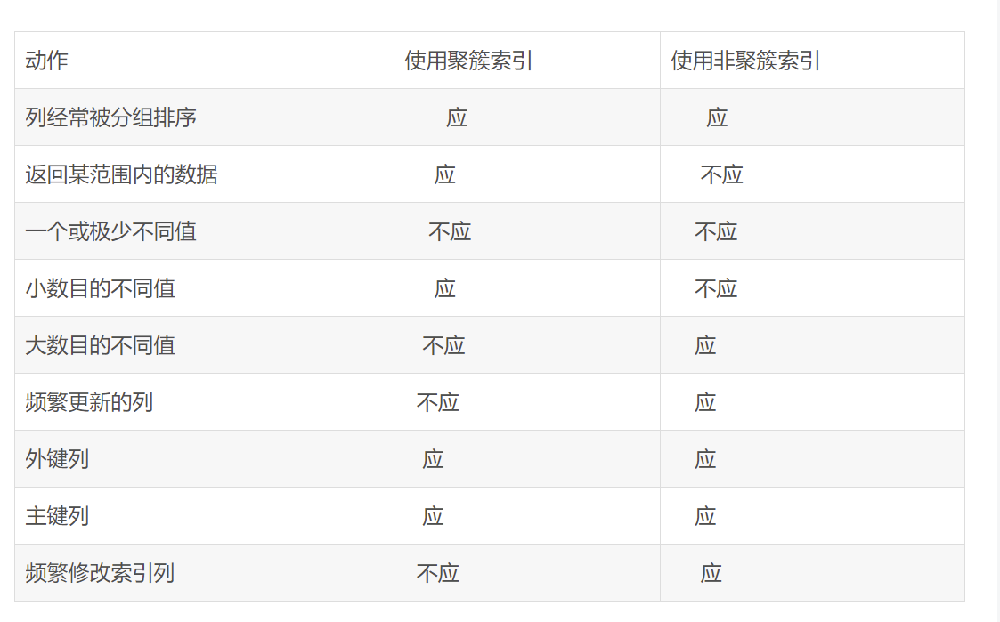

## 聚簇索引和非聚簇索引有什么区别？什么情况用聚集索引？

### 聚簇索引
聚簇索引就是按每张表的主键构建一棵B+树，同时叶子节点存放的就是整张表的行记录数据，也将聚簇索引的叶子
节点成为数据页。这个特性决定了索引组织表中数据也是索引的一部分，每张表只能拥有一个聚簇索引。
InnoDB通过主键聚集数据，如果没有定义主键，InnoDB会选择非空的唯一索引代替。如果没有这样的索引，
InnoDB会隐式的定义一个主键来作为聚簇索引。  
#### 优点
1.数据访问更快，因为聚簇索引将索引和数据保存在同一颗B+树中，因此从聚簇索引中获得数据比非聚簇索引更快。  
2.聚簇索引对于主键的排序查找和范围查找速度非常快
#### 缺点
1.插入速度严重依赖于插入顺序，按照主键的插入顺序是最快的方式，否则会出现页分裂，严重影响性能。因此，对于InnoDB，我们一般都会定义一个自增的ID列为主键。  
2.更新主键的代价很高，会导致被更新的行移动。因此对于InnoDB表，我们一般定义主键为不可更新。  
3.二级索引访问需要两次索引查找，第一次找到主键值，第二次根据主键值找到行数据。

### 非聚簇索引
在聚簇索引之上创建的索引称之为辅助索引，辅助索引访问数据总是需要二次查找。辅助索引叶子节点存储的不再是
行的物理位置，而是主键值。通过辅助索引首先找到的是主键值，再通过主键值找到数据行的数据页，再通过
数据页中的Page Directory找到数据行。  
InnoDB辅助索引的叶子节点并不包含行记录的全部数据，叶子节点除了包含键值外，还包含了相应行数据的聚簇索引。  
辅助索引的存在不影响数据在聚簇索引中的组织，所以一张表可以有多个辅助索引。在InnoDB中有时也称辅助索引为二级索引。  

### 区别
聚簇索引将数据存储与索引放到了一块，找到索引也就找到了数据。非聚簇索引将数据与索引分开存储。  
聚簇索引查找记录要比非聚簇索引更快一点，而非聚簇索引查找总是需要二次访问。

### 应用场景

